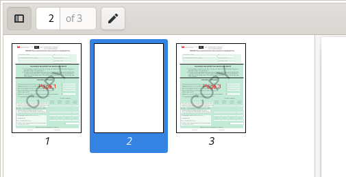

# openpdf-eliminatestreams-issue

## Building

mvn assembly:assembly

## Running

java -jar target/EliminateSharedStreamsIssue-1.0-SNAPSHOT-jar-with-dependencies.jar

## Notes

Sample PDF is generated using pdf-lib and based on the file from https://github.com/Hopding/pdf-lib/issues/47#issuecomment-569315318 .

Sample keystore is a public snake-oil keystore from https://github.com/Keyfactor/signserver-ce

## Results

